This is a [Next.js](https://nextjs.org) project bootstrapped with [`create-next-app`](https://nextjs.org/docs/app/api-reference/cli/create-next-app).

## Getting Started

First, run the development server:

```bash
npm run dev
# or
yarn dev
# or
pnpm dev
# or
bun dev
```

Open [http://localhost:3000](http://localhost:3000) with your browser to see the result.

You can start editing the page by modifying `app/page.tsx`. The page auto-updates as you edit the file.

This project uses [`next/font`](https://nextjs.org/docs/app/building-your-application/optimizing/fonts) to automatically optimize and load [Geist](https://vercel.com/font), a new font family for Vercel.

## Learn More

To learn more about Next.js, take a look at the following resources:

- [Next.js Documentation](https://nextjs.org/docs) - learn about Next.js features and API.
- [Learn Next.js](https://nextjs.org/learn) - an interactive Next.js tutorial.

You can check out [the Next.js GitHub repository](https://github.com/vercel/next.js) - your feedback and contributions are welcome!

## Deploy on Vercel

The easiest way to deploy your Next.js app is to use the [Vercel Platform](https://vercel.com/new?utm_medium=default-template&filter=next.js&utm_source=create-next-app&utm_campaign=create-next-app-readme) from the creators of Next.js.

Check out our [Next.js deployment documentation](https://nextjs.org/docs/app/building-your-application/deploying) for more details.

---
<br>

# Laporan Praktikum

|  | Pemrograman Berbasis Framework 2025 |
|--|--|
| NIM |  2241720206 |
| Nama |  Triyana Dewi Fatmawati |
| Kelas | TI - 3D |


## Praktikum 1: Menyiapkan Lingkungan Pengembangan
### Pertanyaan Praktikum 1
#### 1. Jelaskan kegunaan masing-masing dari Git, VS Code dan NodeJS yang telah Anda install pada sesi praktikum ini! 
> **Jawab:** <br>
> - Git adalah tools yang digunakan untuk Version Control System (VCS) atau mengelola perubahan kode selama pengembangan perangkat lunak.
> - VS Code adalah aplikasi yang digunakan untuk penulisan kode program.
> - NodeJS adalah runtime environment berbasis JavaScript yang memungkinkan eksekusi kode JavaScript di sisi server.

#### 2. Buktikan dengan screenshoot yang menunjukkan bahwa masing-masing tools tersebut telah berhasil terinstall di perangkat Anda!
> **Jawab:**
> 1. Git <br>
> 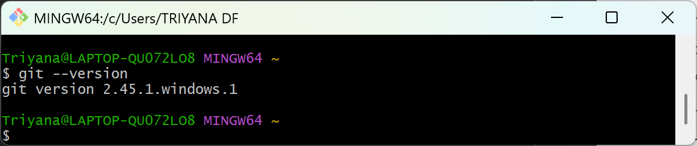
>
> 2. VS Code <br>
>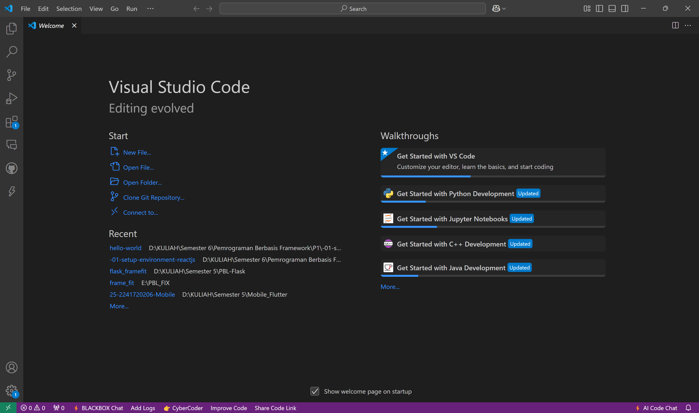
>
> 3. NodeJS <br>
> 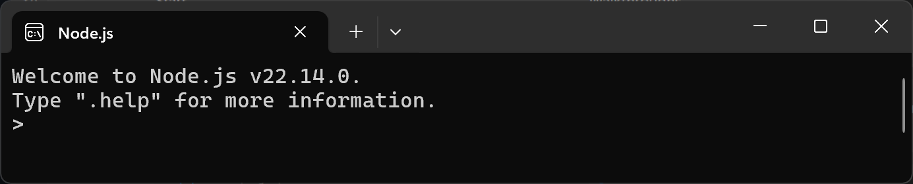

---

## Praktikum 2: Membuat Proyek Pertama React Menggunakan Next.js

1. Membuat folder proyek baru dengan nama <br>
`belajar-react`. <br> Melalui konsol/command 
prompt/CMD masuk ke dalam folder tersebut dan jalankan perintah ini: <br> 
`npx create-next-app `

2. Buat proyek baru dengan nama hello-world seperti di bawah ini. Nama proyek ini perlu 
dimasukkan pertama kali melalui konsol.
    > **Pengerjaan:** <br>
    > 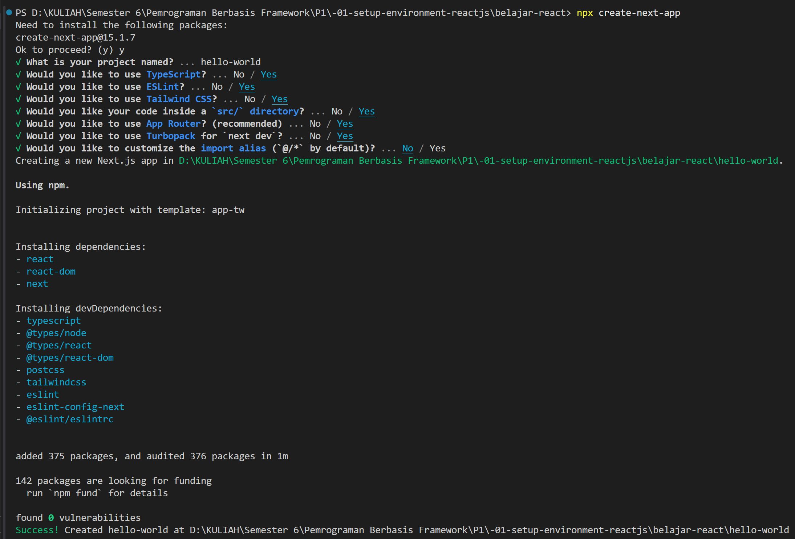

3. Buka folder proyek hello-world menggunakan VS Code. Masuk ke dalam folder proyek hello
world dengan perintah: <br>
`cd hello-world` <br>
Kemudian setelah masuk ke folder hello-world, masukkan perintah: <br> 
`code .` <br>
Maka VS Code akan membuka project react Anda yang telah dibuat bernama `hello-world`. Dan akan menampilkan struktur folder proyek seperti di bawah ini.
    > **Pengerjaan:** <br>
    > 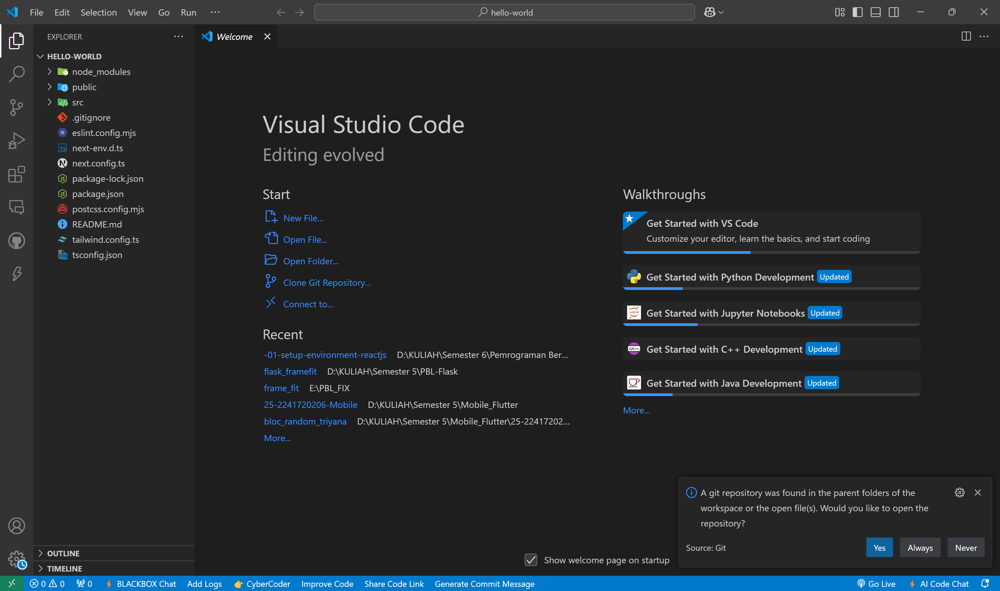

4. Running proyek hello-world dengan memasukkan perintah di bawah ini melalui konsol atau 
terminal di dalam VS Code. <br>
`npm run dev` <br> 
Tunggu proses kompilasi hingga selesai. Lalu Anda dapat membuka alamat localhost di 
browser: http://localhost:3000/
    > **Pengerjaan:** <br>
    > 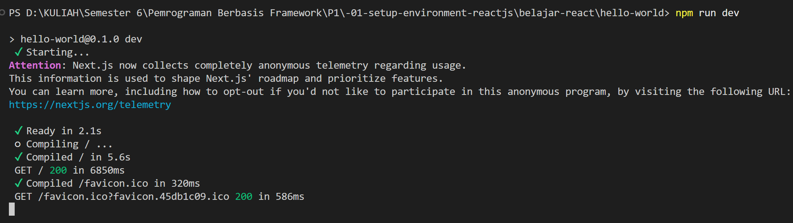

Jika di browser telah tampil seperti gambar berikut ini, Selamat! <br>
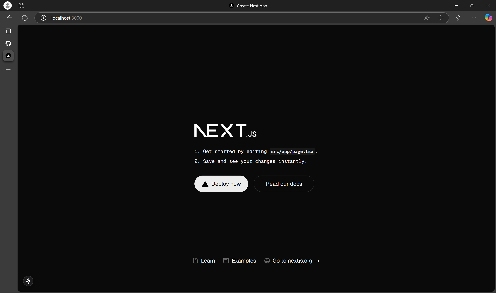

### Pertanyaan Praktikum 2 
#### 1. Pada Langkah ke-2, setelah membuat proyek baru menggunakan Next.js, terdapat beberapa istilah yang muncul. Jelaskan istilah tersebut, TypeScript, ESLint, Tailwind CSS, App Router, Import alias, dan Turbopack!
> **Jawab:** <br>
> - **Typescript** adalah bahasa pemrograman berbasis JavaScript yang menambahkan tipe data statis. Typescript membuat kode lebih terstruktur, mudah dikelola, dan membantu mengurangi bug dengan memvalidasi tipe data sebelum runtime.
>
> - **ESlint** adalah alat untuk memeriksa kode JavaScript atau TypeScript yang kita tulis sesuai aturan atau tidak. 
>
> - **Tailwind CSS** adalah framework CSS yang digunakan sebagai styling untuk membantu membangun UI dengan cepat menggunakan kelas-kelas yang sudah disediakan tanpa harus menulis CSS secara manual.
>
> - **App Router** adalah sistem routing terbaru di Next.js yang berbasis pada file di dalam folder app/.
>
> - **Import alias** memungkinkan kita menggunakan jalur impor yang lebih pendek dan mudah dibaca. 
>
> - **Turbopack** adalah bundler baru (Bundler = alat yang digunakan untuk menggabungkan (bundle) berbagai file kode sumber seperti JavaScript, CSS, gambar, dan asset lainnya menjadi satu atau beberapa file yang dioptimalkan agar lebih efisien untuk dijalankan di browser.) yang dikembangkan oleh Vercel untuk Next.js sebagai pengganti Webpack. Tujuan utamanya adalah meningkatkan kecepatan dalam membangun proyek (build) dan menjalankan aplikasi dalam mode pengembangan.

#### 2. Apa saja kegunaan folder dan file yang ada pada struktur proyek React yang tampil pada gambar pada tahap percobaan ke-3! 
> **Jawab:** <br>
> - **.next/** merupakan folder build yang dihasilkan oleh Next.js saat aplikasi dikompilasi. Berisi file cache, hasil build, dan optimasi performa.
>
> - **node_modules/** berisi semua dependensi (library dan package) yang diinstal.
>
> - **public/** merupakan folder untuk menyimpan file statis seperti gambar, font, atau favicon. File dalam folder ini bisa diakses langsung melalui URL tanpa perlu import ke dalam kode.
>
> - **src/app/** merupakan folder utama untuk menyimpan komponen dan halaman aplikasi. Menggunakan App Router (fitur baru Next.js). <br>
> **File penting dalam src/app/:** <br>
    > **- favicon.ico** → Ikon kecil yang muncul di tab browser. <br>
    > **- globals.css** → File CSS global untuk mengatur gaya seluruh aplikasi. <br>
    > **- layout.tsx** → File untuk menentukan tata letak global (header, sidebar, dll.). <br>
    > **- page.tsx** → File utama untuk halaman root (/), setara dengan index.js di React.
>
> - **.gitignore** digunakan untuk menentukan file dan folder yang harus diabaikan oleh Git (misalnya node_modules/ dan .next/).
>
> - **eslint.config.mjs** berisi konfigurasi ESLint yang digunakan untuk memastikan kode JavaScript/TypeScript tetap bersih dan bebas error.
>
> - **next-env.d.ts** memastikan proyek Next.js dapat berjalan dengan TypeScript tanpa konfigurasi tambahan.
>
> - **next.config.ts** file konfigurasi Next.js yang digunakan untuk mengatur base path, kompresi, dan optimasi gambar.
>
> - **package-lock.json** mengunci versi dependensi agar tidak berubah.
>
> - **package.json** berisi informasi proyek, dependensi, dan skrip npm.
>
> - **postcss.config.mjs** konfigurasi untuk PostCSS, yang sering digunakan dengan Tailwind CSS.
>
> - **README.md** berisi dokumentasi proyek, biasanya berisi petunjuk penggunaan dan informasi penting lainnya.
>
> - **tailwind.config.ts** konfigurasi Tailwind CSS, termasuk tema warna, breakpoint, dan kustomisasi lainnya.
>
> - **tsconfig.json** konfigurasi TypeScript, menentukan aturan penggunaan tipe data di proyek Next.js.

#### 3. Buktikan dengan screenshoot yang menunjukkan bahwa tahapan percobaan di atas telah berhasil Anda lakukan!
> **Jawab:** <br>
> 

---

## Praktikum 3: Menambahkan Komponen React (Button)
Aplikasi React dibuat dari **komponen**. Komponen adalah bagian dari UI (user interface, antarmuka pengguna) yang memiliki logika dan tampilan tersendiri. Sebuah komponen dapat berukuran sekecil tombol, atau sebesar seluruh halaman. **Komponen React adalah fungsi JavaScript yang mengembalikan markup.**

1. Di dalam folder proyek yang telah dibuka di VS Code, buka file page.tsx 

2. Tambahkan fungsi MyButton yang mengembalikan markup komponen button yang akan ditambahkan ke dalam webpage
    > **Pengerjaan:** <br>
    > 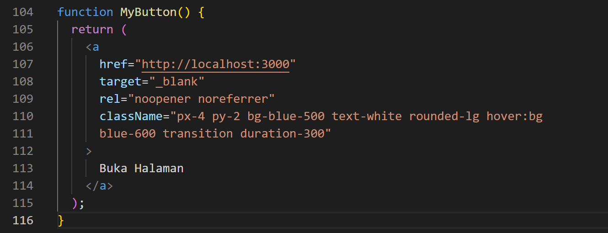

3. Tambahkan komponen button tersebut di samping button Read Our Docs. 
    > **Pengerjaan:** <br>
    > 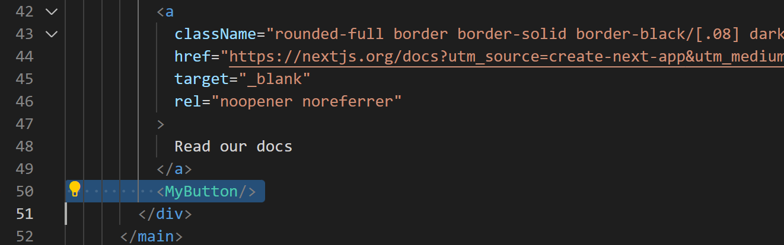

    Perhatikan bahwa komponen **`MyButton`** dimulai dengan huruf kapital. Dengan cara itulah Anda mengetahui bahwa itu adalah sebuah komponen React. Nama komponen React harus **selalu dimulai dengan huruf kapital**, sedangkan tag HTML harus menggunakan huruf kecil. Kata kunci **`export default`** menentukan komponen utama di dalam berkas (file).

4. Simpan perubahan dan coba lihat perubahan melalui web browser! 

### Pertanyaan Praktikum 3 
#### 1. Buktikan dengan screenshoot yang menunjukkan bahwa tahapan percobaan di atas telah berhasil Anda lakukan! 
> **Jawab:** <br>
> 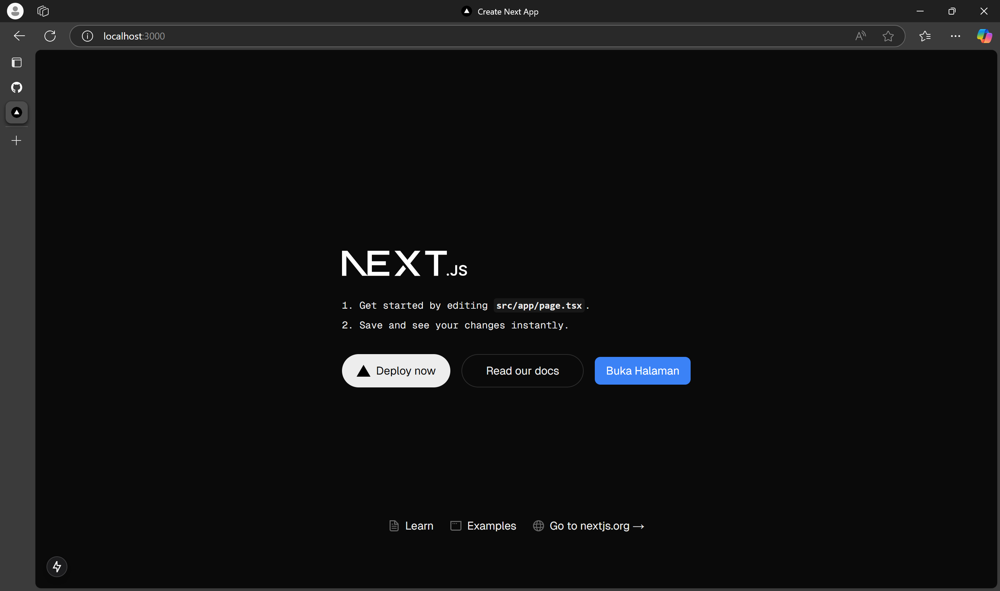

---

## Praktikum 4: Menulis Markup dengan JSX 
Sintaksis markup yang Anda lihat di atas disebut dengan JSX. JSX ini opsional, tetapi sebagian besar proyek React menggunakan JSX untuk kenyamanannya. Semua alat yang kami rekomendasikan untuk pengembangan lokal mendukung JSX secara langsung. JSX lebih ketat daripada HTML. Anda harus menutup tag seperti `<br />`. Komponen Anda juga tidak boleh mengembalikan beberapa tag JSX. Anda harus membungkusnya menjadi induk bersama (shared parent), seperti `<div>...</div>` atau sebuah pembungkus kosong `<>...</>`:

1. Tambahkan kode JSX di bawah ini ke dalam file page.tsx.
    > **Pengerjaan:** <br>
    > 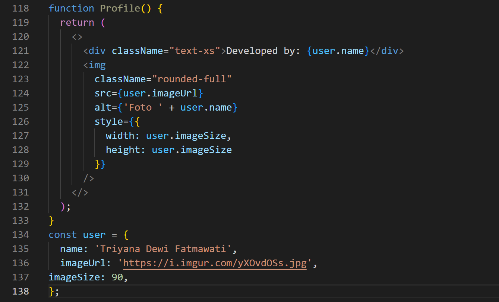

2. Tambahkan komponen MyProfile setelah komponen MyButton.
    > **Pengerjaan:** <br>
    > 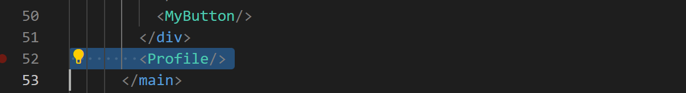
    
3. Simpan dan amati perubahan di halaman web yang dihasilkan! 

### Pertanyaan Praktikum 4
#### 1. Untuk apakah kegunaan sintaks user.imageUrl? 
> **Jawab:** <br>
> Sintaks user.imageUrl digunakan untuk mengambil nilai dari properti imageUrl dalam objek user.

#### 2. Buktikan dengan screenshoot yang menunjukkan bahwa tahapan percobaan di atas telah berhasil Anda lakukan! 
> **Jawab:** <br>
> 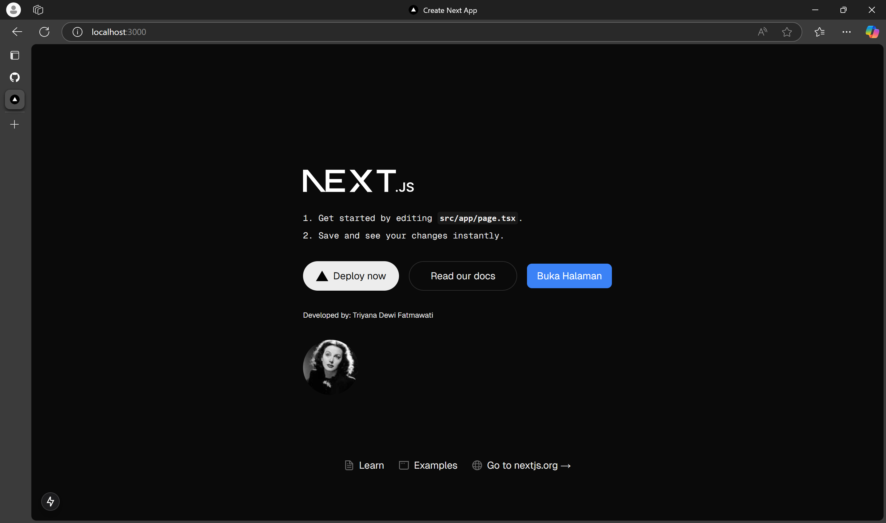
